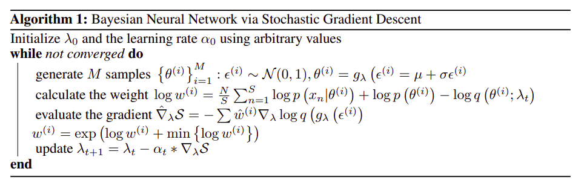
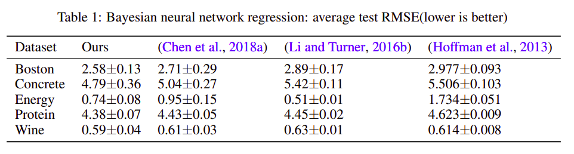
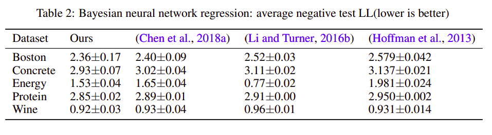

# Bayesian Neural Network via Stochastic Gradient Descent
Code for the paper `Bayesian Neural Network via Stochastic Gradient Descent`.

https://arxiv.org/pdf/2006.08453

## Abstract

The goal of bayesian approach used in variational inference is to minimize the KL
divergence between the variational distribution and unknown posterior distribution.
This is done by maximizing the Evidence Lower Bound (ELBO). A neural network
is used to parametrize these distributions using Stochastic Gradient Descent. This
work derives the variational inference models using bayesian neural networks. We
show how SGD can be applied on bayesian neural networks by gradient estimation
techniques. For validation, we have tested our model on 5 UCI datasets and the
metrics chosen for evaluation are Root Mean Square Error (RMSE) error and
negative log likelihood. Our work considerably beats the previous state of the art
approaches for regression using SGD.

## Data

The dataset can be downloaded from [here](https://archive.ics.uci.edu/ml/datasets.php?format=&task=reg&att=&area=&numAtt=&numIns=&type=&sort=nameUp&view=table).

## Algorithm



## Installation

`python code/bnn.py`

## Results
 
Bayesian neural network regression: average test RMSE
 


Bayesian neural network regression: average negative test Log Likelihood



## Citing

If you find this code useful in your research, please consider citing the paper:

BibTex:

```
@article{sagar2020bayesian,
  title={Bayesian Neural Network via Stochastic Gradient Descent},
  author={Sagar, Abhinav},
  journal={arXiv preprint arXiv:2006.08453},
  year={2020}
}
```

APA:

`Sagar, A. (2020). Bayesian neural network via stochastic gradient descent. arXiv preprint arXiv:2006.08453.`

## License

```
MIT License

Copyright (c) 2020 Abhinav Sagar

Permission is hereby granted, free of charge, to any person obtaining a copy
of this software and associated documentation files (the "Software"), to deal
in the Software without restriction, including without limitation the rights
to use, copy, modify, merge, publish, distribute, sublicense, and/or sell
copies of the Software, and to permit persons to whom the Software is
furnished to do so, subject to the following conditions:

The above copyright notice and this permission notice shall be included in all
copies or substantial portions of the Software.

THE SOFTWARE IS PROVIDED "AS IS", WITHOUT WARRANTY OF ANY KIND, EXPRESS OR
IMPLIED, INCLUDING BUT NOT LIMITED TO THE WARRANTIES OF MERCHANTABILITY,
FITNESS FOR A PARTICULAR PURPOSE AND NONINFRINGEMENT. IN NO EVENT SHALL THE
AUTHORS OR COPYRIGHT HOLDERS BE LIABLE FOR ANY CLAIM, DAMAGES OR OTHER
LIABILITY, WHETHER IN AN ACTION OF CONTRACT, TORT OR OTHERWISE, ARISING FROM,
OUT OF OR IN CONNECTION WITH THE SOFTWARE OR THE USE OR OTHER DEALINGS IN THE
SOFTWARE.
```
